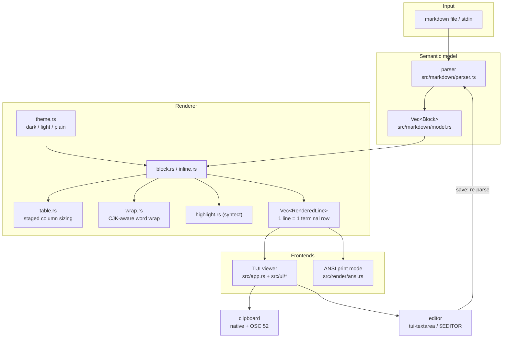
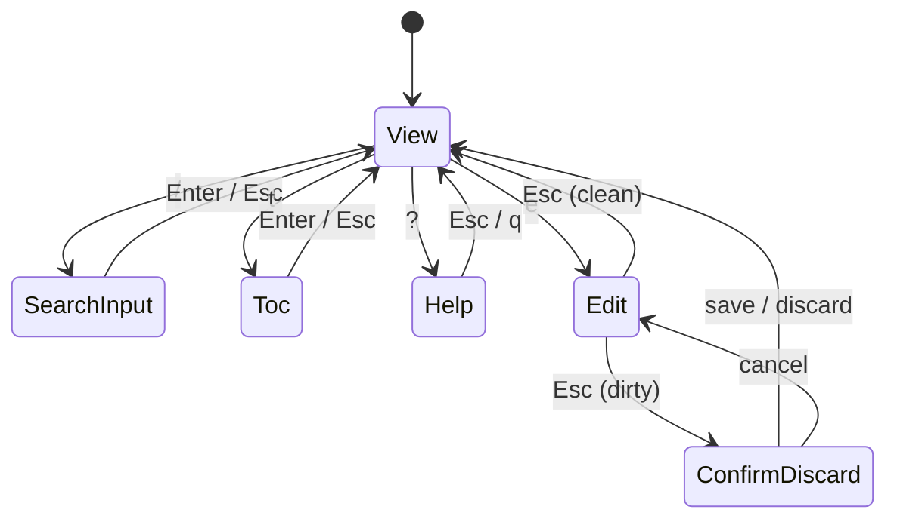

# Architecture

mdpad is a terminal markdown reader/editor whose whole reason to exist is
**rendering quality and navigation**: headings, nested/mixed lists and above
all tables must stay readable at any terminal width. Secondary goal: quick
edits without leaving the tool. Constraints: OS-agnostic (Linux, macOS,
Windows), single lightweight binary, zero configuration.

## System shape

## Core components

| Component | Path | Responsibility |
|---|---|---|
| Model | `src/markdown/model.rs` | Semantic document tree (blocks + inlines), independent of any rendering concern |
| Parser | `src/markdown/parser.rs` | pulldown-cmark event stream -> model, tolerant of malformed input |
| Theme | `src/render/theme.rs` | All colors/glyphs; dark, light and plain (no-color) variants; unicode + ascii charsets |
| Wrap | `src/render/wrap.rs` | Style-preserving word wrap, CJK/emoji aware, grapheme-safe hard breaks |
| Inline | `src/render/inline.rs` | Inlines -> styled spans; link URL policy |
| Links | `src/render/links.rs` | Link registry; destinations survive wrapping as per-line clickable ranges |
| Block | `src/render/block.rs` | Blocks -> pre-wrapped visual lines; lists, quotes, code, headings |
| Table | `src/render/table.rs` | Column sizing (staged water-fill), alignment heuristics, borders |
| Highlight | `src/render/highlight.rs` | syntect code highlighting, 256-color quantization |
| ANSI | `src/render/ansi.rs` | Rendered lines -> ANSI text for print mode |
| App | `src/app.rs` | State machine (view/search/toc/help/edit/confirm) + event loop |
| Viewer | `src/ui/viewer.rs` | Viewport, scrollbar, highlight overlays |
| Selection | `src/ui/selection.rs` | Mouse selection: cell-to-byte mapping, extraction, highlight |
| Navigate | `src/ui/navigate.rs` | Link classification/resolution, OS opener, back history, link hit-test |
| Clipboard | `src/ui/clipboard.rs` | Native OS clipboard + OSC 52 escape channel |
| Editor | `src/ui/editor.rs` | Built-in raw-markdown editor, atomic saves, `$EDITOR` handoff |
| Terminal | `src/ui/term.rs` | Raw mode, alternate screen, panic-safe restore |

## Key design decisions

1. **Pre-wrapped lines.** The renderer emits lines that each occupy exactly
   one terminal row. Scrolling, search jumps, TOC anchors, mouse selection
   and the scrollbar are then exact index arithmetic — no estimation, no
   drift. Resize simply re-renders at the new width.
2. **One renderer, two frontends.** The TUI viewer and `--print` share the
   same rendering pipeline, so print output is a faithful, testable proxy
   for what the viewer shows. Integration tests assert invariants (no line
   overflows the width, no content lost) across many widths.
3. **Tables degrade in stages** (see [Rendering pipeline](rendering.md)):
   natural widths -> protect headers + typical content -> drop padding ->
   wrap headers at words -> only then hard-break words. A single outlier
   cell cannot reserve air for a whole column (80th-percentile "typical
   width" rule). Tables that cannot fit as a grid render as per-row records.
4. **Editing is raw-text, reader-first.** The built-in editor edits markdown
   source with undo/redo and save-and-re-render; `$EDITOR` integration
   covers power users. No WYSIWYG: that scope kills tools of this size.
5. **Selection is anchored to document lines**, not screen cells, so it
   survives scrolling; copies go through both the native OS clipboard and
   OSC 52 so they work locally and over SSH
   (see [Selection & clipboard](clipboard.md)).
   Links reuse the same cell-to-byte machinery: destinations ride through
   the wrapper inside the span style (an otherwise-unused channel), are
   harvested into per-line byte ranges after layout, and a click hit-tests
   those ranges — local files open in-viewer with a back history
   (`Backspace`), URLs go to the OS handler.
6. **Trust the terminal.** 256-color indexed palette by default, truecolor
   only for syntax highlighting when `COLORTERM` advertises it; `--ascii`
   for glyph-poor environments; `NO_COLOR` honored.

## Mode state machine

`E` (external editor) suspends the TUI, runs `$VISUAL`/`$EDITOR` as a child
process, then resumes and reloads the file.

## Testing strategy

- Unit tests per module: wrap correctness (including CJK), table sizing,
  parser shapes, search smart-case, selection cell mapping, ANSI escapes.
- Integration tests run the real binary over fixtures at widths 30–200 and
  assert: no overflow, all content present, styled lines self-terminate,
  pathological inputs exit cleanly.
- CI runs the suite on Linux, macOS and Windows, plus fmt, clippy
  (`-D warnings`) and a static musl build.

## See also

- [Rendering pipeline](rendering.md) — the data flow and table sizing
  algorithm in detail
- [CONTRIBUTING.md](../CONTRIBUTING.md) — how to build and test locally
