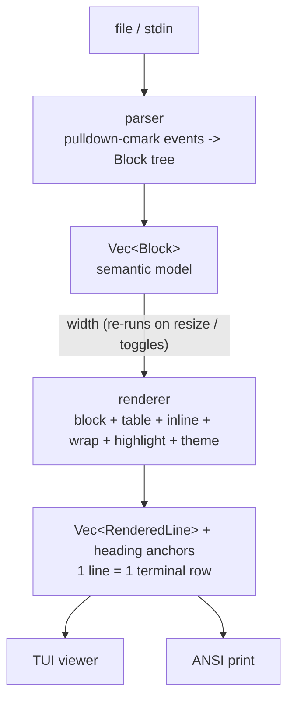

# Rendering pipeline

This deep dive explains how markdown text becomes terminal rows, and how
tables are sized. For the component map, see [Architecture](architecture.md).

## Data flow

**Inputs.** Markdown text (file path or stdin) — any UTF-8 content;
malformed markdown parses to *something* rather than failing. Terminal
width (or `--width`), theme flags, link-URL mode.

**Outputs.** TUI frames (ratatui buffer), or ANSI text in print mode where
every line resets its style and `--color never` yields pure text.

The invariant that everything else builds on: **every rendered line is
exactly one terminal row**. Scrolling, search, the table of contents,
mouse selection and the scrollbar are all plain index arithmetic on
`Vec<RenderedLine>`. A resize re-renders the whole document at the new
width; rendering is fast enough that this is imperceptible.

## Table sizing

For each column the renderer computes:

- `natural` — widest unwrapped cell
- `minimum` — widest single word, capped at 16 (giant tokens hard-break)
- `header_w` — header width
- `typical` — 80th percentile of body cell widths

Then it tries stages until one fits the budget (width minus borders and
padding); stages whose fixed overhead alone exceeds the width are skipped:

| Stage | Padding | Floors (protected width per column) |
|---|---|---|
| A | 1 | `max(typical, header)` — headers whole, typical content whole |
| B | 1 | `min(floor_A, minimum)` — headers may word-wrap |
| C | 0 | same as A (padding sacrificed) |
| D | 0 | same as B |

If no stage fits — the word minimums overflow even unpadded — the table
renders as **records** instead: one `Header: value` list per row, separated
by short rules. A grid squeezed below word width is unreadable; records
keep every cell legible and are also the fallback for tables that cannot
physically exist at the width (say, 15 columns at width 20).

Within a stage, spare width is distributed by max-min fairness ("water
filling"): every column gets its floor plus an equal share of the surplus,
capped at its natural width, remainder to the neediest columns. Finally,
columns one or two cells short of fitting entirely are topped up by shaving
a wide column that wraps anyway — one extra wrap row there beats a wrap on
every row here.

Columns with no declared alignment right-align when ≥ 70% of their
non-empty, non-placeholder body cells look numeric (digits with `.,%_` and
a leading sign only — internal dashes like dates stay left-aligned).

## Inline and block details

- **Wrap** is style-preserving and Unicode-correct: CJK and emoji count as
  two cells, graphemes never split, and unbreakable tokens (URLs,
  identifiers) hard-break at display-width boundaries only as a last
  resort.
- **Code blocks** carry their language label, syntax highlighting
  (quantized to 256 colors on non-truecolor terminals) and a full-width
  background; tabs expand to real tab stops.
- **Links** render as underlined text; URLs appear inline only with
  `--urls` or the `L` toggle (print mode always shows them — a link you
  cannot follow or read is noise).
- **Prose width** is capped (default 100 columns, `--prose-width`) for
  readability on wide terminals; tables may use the full width.

## View state

- `scroll` is an index into rendered lines, clamped on every draw.
- Search maps the query to byte ranges per line (smart-case); highlights
  apply only to visible lines at draw time; matches recompute on
  re-render.
- The table of contents collects heading anchors from rendered lines;
  `Enter` jumps to the anchor's line index.
- Mouse selection stores (line, column) endpoints in document space and
  converts display columns to byte offsets (CJK-aware) for highlighting
  and extraction — see [Selection & clipboard](clipboard.md).
- The editor holds the raw source in a `tui-textarea` buffer; saving
  writes atomically (temp file + rename), re-parses and re-renders.

## See also

- [Architecture](architecture.md) — components and design decisions
- [CLI & keys](api.md) — the flags that influence rendering
